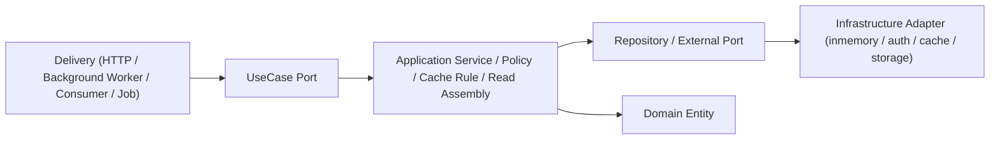

# 아키텍처

## 핵심 원칙

- Layered Architecture
- Port & Adapter (Hexagonal)
- Domain 중심 설계
- interface/implementation 분리
- I/O, blocking work, cancellation, trace 전파가 필요한 delivery/application/infrastructure 경계 메서드는 `context.Context`를 첫 번째 인자로 받는다.
- delivery에서 시작한 `ctx`는 use case, service, repository/adapter, `UnitOfWork` 경계까지 끊지 않고 전달한다.
- `context.WithValue`는 delivery/middleware 같은 경계에서만 제한적으로 사용한다.

## 레이어 구조



- `delivery`
  - HTTP parsing, 인증 미들웨어 연결, status/header/response 직렬화, request body와 multipart 같은 transport 경계 제한을 담당한다.
  - background delivery는 polling, schedule trigger, retry/ack, graceful shutdown 경계 관리만 담당한다.
  - HTTP handler와 background worker/job/consumer 모두 use case port만 호출하고, repository/DB 구현체를 직접 호출하지 않는다.
  - JSON 요청 바디 제한은 `delivery.http.maxJSONBodyBytes` 설정으로 적용한다.
- `application`
  - 유스케이스 orchestration, 권한 판정, 캐시 정책, tx 경계, read model 조립을 담당한다.
  - 단, 하나의 service가 read assembly, policy, workflow, event dispatch를 모두 직접 품지 않는다. 복잡해지는 경로는 내부 handler/coordinator/workflow로 분해하고 service는 facade로 유지한다.
  - 도메인 패키지 재배치 전에 여러 서비스가 공유하는 helper는 `service/common` 패키지로 먼저 분리한다.
  - 현재 도메인별 구현은 `service/<domain>` 하위 패키지에 두고, 루트 `service`는 외부 wiring을 위한 공개 facade만 유지한다.
  - 로깅이 필요하면 composition root에서 주입한 `*slog.Logger`를 사용한다.
  - `Repository`, `Cache`, `SessionRepository`, `FileStorage` 같은 I/O 성격의 하위 포트 호출에는 동일한 `ctx`를 그대로 전달한다.
  - 순수 값 변환, 해시/토큰 계산, in-process dispatcher 같은 non-I/O 포트는 `ctx`를 생략할 수 있다.
- `domain`
  - 엔티티 상태와 도메인 규칙을 가진다.
- `infrastructure`
  - 저장소, 캐시, 토큰, 파일 저장소 같은 외부 구현체를 제공한다.

읽기 경로에서도 동일한 경계를 유지한다.

- Delivery는 쿼리 파라미터/헤더를 해석하고 UseCase만 호출한다.
- Application은 필요한 read assembly를 수행하되, repository를 반복 호출하는 N+1 패턴은 가능한 포트 확장이나 query helper로 흡수한다.
- read path가 커지는 경우 service 안에 계속 누적하지 않고, `postDetailQuery` 같은 read-side query component로 분리한다.
- ranking/feed 같은 비동기 read-side projection도 `PostRankingRepository` 같은 별도 포트로 분리하고, 공개 query service는 projection + 원본 entity 조립만 담당한다.
- write path도 동일하게 service 메서드에 workflow가 누적되지 않도록 `postCommandHandler`, `postTagCoordinator`, `postAttachmentCoordinator`, `postDeletionWorkflow` 같은 내부 협력 객체로 분해한다.
- 댓글 read path에서 `parent_uuid` 같은 projection 규칙은 comment 하위 패키지 helper로 수렴시켜 comment list/detail과 post detail query가 동일 규칙을 재사용한다.
- Infrastructure는 batched read 같은 조회 최적화를 구현 세부로 숨긴다.

## 요청 흐름

- HTTP 요청
  - `HTTP Delivery -> UseCase Port -> Service -> Repository Port -> Infrastructure Adapter`
- Background 실행
  - `Background Delivery -> UseCase Port -> Service -> Repository Port -> Infrastructure Adapter`
- Outbox relay
  - outbox relay는 도메인 변경을 수행하는 use case가 아니라 outbox 전달/후속 소비를 담당하는 background delivery adapter다.

Composition root는 `cmd/main.go` 에 두고, wiring 단계에서만 concrete 구현체를 조립합니다.

## 사용자 식별자 정책

- 내부 PK/FK는 `int64`를 유지한다.
- 외부에 노출하는 사용자 식별자는 `User.UUID`를 사용한다.
- 게시글/댓글/리액션 응답은 내부 `author_id`/`user_id` 대신 `author_uuid`/`user_uuid`를 노출한다.
- 공개 도메인 리소스(`User`, `Board`, `Post`, `Comment`, `Attachment`)의 기본 외부 식별자는 UUID로 통일한다.
- 운영 리소스(`reportID`, `messageID`)는 운영 추적성과 수동 조치 편의를 위해 예외적으로 숫자/opaque ID를 유지한다.
- 공개 목록 API는 opaque `cursor`, 운영 목록 API는 `last_id`를 사용할 수 있다.
- soft delete 후에도 `uuid`는 유지되며, `name` 같은 식별 정보만 익명화한다.

## 인증/인가 흐름

- 인증
  - 최초 비로그인 브라우저는 `POST /api/v1/auth/guest`로 서버 발급 guest bearer token을 받을 수 있다.
  - `gin` middleware가 `Authorization` 헤더에서 토큰 추출
  - `SessionUseCase`가 동일 request `ctx`로 JWT 검증 + `SessionRepository` 세션 확인 수행
  - 검증 성공 후 `context.user_id` 주입
  - guest도 일반 사용자와 동일한 `user_id`, `uuid`, 세션을 가지므로 post/comment write ownership 모델을 그대로 재사용한다.
  - guest는 내부적으로 `pending`, `active`, `expired` lifecycle을 가지며, `active guest`만 유효 세션 사용자로 인정한다.
- 인가
  - HTTP admin middleware를 포함한 권한 확인은 application port를 통해 수행하고, 실제 판정은 Service 레이어에서 주입된 `AuthorizationPolicy`로 처리한다.
  - 기본 정책: `AdminOnly`, `OwnerOrAdmin`
  - suspension 운영 API의 외부 대상 식별자는 `user_uuid`를 사용한다.
  - 1차 guest 정책은 post/comment create/update/delete까지만 허용하고, draft/publish, attachment, reaction, report는 service에서 명시적으로 차단한다.

## 세션 유효성 흐름

- login: `SessionUseCase`가 사용자 인증 후 토큰 발급 + `SessionRepository` 저장
- login HTTP handler는 글로벌 `/api/v1` rate limit 외에 `client_ip + normalized_username` 기준 전용 rate limit을 먼저 적용하고, rate-limited audit만 handler에서 남긴다.
- guest issue: `SessionUseCase`가 `pending guest 생성 -> token 준비 -> active 전환 -> session 저장` 흐름으로 처리한다.
- `active` 전환 실패 시 session은 저장하지 않고 에러를 반환한다.
- session 저장 실패 시 guest는 `expired`로 전환하고 인증 경로에서 거절한다.
- 현재 In-Memory 구현은 cache 기반 `SessionRepository`를 사용한다.
- 세션 키는 `user_id + token` 기준으로 관리해 사용자 단위 무효화가 가능하도록 유지
- protected route: middleware가 `SessionUseCase`로 세션 검증
- logout: `SessionUseCase`가 해당 토큰 세션만 삭제
- delete me: `AccountUseCase`가 계정 삭제 후 해당 사용자의 세션 전체 무효화를 시도
- guest upgrade: `AccountUseCase`가 현재 guest user row를 정식 user로 승격하고, 기존 `id`, `uuid`, 작성물 소유권은 유지하되, replacement bearer token이 durable 해진 뒤에만 현재 guest token 세션을 폐기한다.
- guest upgrade는 user row 승격과 token 교체를 하나의 성공 경계로 처리하며, 중간 실패 시 기존 guest/session 상태를 유지한 채 replacement session만 되돌린다.
- guest upgrade HTTP handler는 글로벌 `/api/v1` rate limit 외에 `user_id + client_ip` 기준 전용 rate limit을 먼저 적용하고, rate-limited audit만 handler에서 남긴다.
- email verification request: `AccountUseCase`가 현재 로그인 사용자를 기준으로 이전 token을 삭제하고 새 1회용 token을 pending 상태로 저장한 뒤, 같은 tx에 outbox mail event를 append한다. outbox relay가 메일 발송 성공 후 정확한 token hash만 활성화한다. HTTP는 이 엔드포인트에 `user_id` 기준 전용 rate limit을 추가 적용한다.
- email verification confirm: `AccountUseCase`가 token 검증 후 `EmailVerifiedAt`을 기록하고, 같은 사용자의 verification token을 모두 무효화한다.
- password reset request: `AccountUseCase`가 email 기준으로 활성 일반 사용자를 찾고, 이전 token을 삭제한 뒤 새 1회용 token을 pending 상태로 저장하고, 같은 tx에 outbox mail event를 append한다. outbox relay가 메일 발송 성공 후 정확한 token hash만 활성화한다. HTTP는 이 엔드포인트에 `client_ip + normalized_email` 기준 전용 rate limit을 추가 적용한다.
- password reset confirm: `AccountUseCase`가 사용자 락 아래에서 token/user를 재검증하고, 전체 세션 무효화가 성공한 뒤에만 비밀번호 변경 + token 소모를 commit한다.
- guest cleanup: background job이 오래된 `pending`/`expired` guest와, 세션 없음 + 작성물 없음 상태로 유예 시간이 지난 `active` guest를 soft delete 대상으로 정리한다.
- email verification cleanup: background job이 grace period가 지난 expired/consumed verification token을 정리한다.
- password reset cleanup: background job이 grace period가 지난 expired/consumed reset token을 정리한다.
- 현재 계정 삭제 후 세션 정리는 best effort 정책이며, 실패 시 구조화 로그만 남기고 계정 삭제 성공을 유지

## 비밀번호 처리

- 비밀번호 해시/비교는 `port.PasswordHasher`로 추상화한다.
- `UserService`는 평문을 저장하지 않고, signup 시 `username/email/password`를 받아 email 유니크 검증 후 해시된 비밀번호만 저장한다.
- signup의 email verification 자동 발송은 `UserService`가 verification token을 pending 상태로 저장하고 outbox event를 append하며, relay가 메일 발송 후 정확한 token hash를 활성화한다.
- guest 계정도 내부 랜덤 비밀번호를 해시해서 저장하지만, 일반 username/password login 대상으로 사용하지 않는다.
- 인증/탈퇴 시에는 저장된 해시와 입력 비밀번호를 비교한다.
- `AuthorizationPolicy.CanWrite`는 공통 쓰기 가능 여부 중 suspension만 확인한다.
- email verification 요구는 기능별 guard로 분리한다.
  - `attachment`, `report`: verified email 필요
  - `reaction`: guest 금지, 일반 미인증 사용자는 허용
  - `post/comment`: 기존 guest lifecycle 정책 유지
- email verification token도 password reset과 같은 해시 저장 + 기본 TTL 30분 + 최신 요청만 유효 정책을 사용하며, 새 요청이 오면 이전 token row는 삭제된다.
- password reset token은 평문이 아니라 해시 저장을 기본으로 하며, 기본 TTL은 30분이고 최신 요청만 유효하며, 새 요청이 오면 이전 token row는 삭제된다.
- SMTP email verification 메일은 frontend verification 페이지 링크와 fallback raw token을 함께 제공한다.
- SMTP password reset 메일은 frontend reset 페이지 링크와 fallback raw token을 함께 제공한다.
- guest 탈퇴 경로는 열지 않는다. guest 계정은 self-delete를 허용하지 않는다.
- 탈퇴는 현재 soft delete + 익명화 정책을 사용한다.
- 탈퇴 시 사용자명, 이메일, 비밀번호 같은 식별 정보는 더 이상 로그인/식별에 사용할 수 없게 비식별화한다.
- `UserRepository.SelectUserByID`, `SelectUserByUsername`는 soft deleted 사용자를 기본 조회에서 제외한다.
- 작성물/리액션 같은 기존 데이터 참조를 위해 `SelectUserByIDIncludingDeleted`를 별도로 둔다.

## 에러 처리 원칙

- 서비스는 원인 분류를 잃지 않도록 에러를 래핑한다.
  - 저장소 실패: `customerror.ErrRepositoryFailure`
  - 캐시 실패: `customerror.ErrCacheFailure`
  - 토큰 발급 실패: `customerror.ErrTokenFailure`
- 외부 계약으로 노출되는 에러는 공개 sentinel로 수렴한다.
  - 예: `ErrUserNotFound`, `ErrForbidden`, `ErrInvalidToken`
  - HTTP 계층은 `customerror.Public(err)`로 응답 메시지를 정규화한다.
- 내부 원인 문자열은 응답에 직접 노출하지 않는다.
  - 운영 추적은 구조화 로그에서 수행한다.

## HTTP 예외 처리/로깅

- `delivery.writeUseCaseError`가 공개 에러 -> HTTP status 매핑의 단일 진입점이다.
- 4xx/5xx 모두 composition root에서 주입된 `*slog.Logger`를 통해 구조화 로그를 남긴다.
  - 공통 필드: method, path, request_uri, user_id(가능 시), status, public_error
- 5xx는 상세 원인을 로그로 남기되, 응답에는 `internal server error`만 노출한다.
- auth 민감 이벤트는 서비스/handler에서 별도 audit log를 남긴다.
  - `login_attempt`: `username_sha256`, `outcome`
  - `guest_upgrade_attempt`: `user_id`, `outcome`
  - `rate_limited` outcome은 handler만 기록하고, 성공/도메인 실패 outcome은 service가 기록한다.

## 캐시 포트 확장

- `port.Cache`는 인증 캐시와 조회 캐시를 단일 포트로 관리
- 모든 cache 연산은 `ctx`를 첫 번째 인자로 받고, `GetOrSetWithTTL` loader도 `func(ctx context.Context) (interface{}, error)` 시그니처를 사용한다.
- 기본 연산
  - `Get`, `Set`, `SetWithTTL`, `Delete`
- 조회 캐시 확장 연산
  - `DeleteByPrefix(prefix)`: 쓰기 이벤트 후 관련 캐시 일괄 무효화
  - `GetOrSetWithTTL(key, ttl, loader)`: 캐시 미스 시 로더 실행 후 저장
- In-Memory 구현 세부
  - 만료(`TTL`) 지원
  - `singleflight` 기반 동시성 중복 로더 호출 방지

주의: 캐시 정책(TTL, 키 규칙, 무효화 범위)은 Delivery가 아니라 Application 레이어에서 관리하는 것을 기본 원칙으로 한다.

## 이벤트 경계 (EDA 1차)

- Application Port
  - `DomainEvent`: `EventName()`, `OccurredAt()`
  - `EventHandler`: `Handle(ctx context.Context, event DomainEvent)`
  - `EventPublisher`(action dispatcher): `Publish(events ...DomainEvent)`
  - `OutboxStore`: `Append`, `FetchReady`, `MarkSucceeded`, `MarkRetry`, `MarkDead`
  - `EventSerializer`: domain event <-> outbox payload 직렬화
- Event Type (최소 세트)
  - `BoardChanged`
  - `PostChanged`
  - `CommentChanged`
  - `ReactionChanged`
  - `AttachmentChanged`
  - `ReportChanged`
  - `NotificationTriggered`
- 디스패치
  - 서비스는 `dispatchDomainActions(...)`를 통해 도메인 액션을 발행한다.
  - 기본 경로는 트랜잭션 내부 `tx.Outbox().Append(...)` 기록이다.
  - notification inbox 적재처럼 후속 read-model 생성은 별도 전용 이벤트를 발행하고 relay consumer가 저장소에 반영한다.
  - inbox query contract는 read-side projection 위에 `target_kind`, `message_key`, `message_args`, `is_read` 같은 UI-friendly 조립 필드를 추가로 얹는다.
  - ranking feed 갱신도 동일하게 `post.changed`, `comment.changed`, `reaction.changed`를 소비하는 read-side handler가 담당한다.
  - tx outbox가 없는 경계에서는 action dispatcher fallback publish를 허용한다.
  - 이벤트/relay 경계도 동일 `ctx` 전달 원칙을 따르며, cancellation과 shutdown 신호를 상위 context에서 받는다.
  - relay worker가 ready 메시지를 polling해 deserialize 후 핸들러를 비동기로 호출한다.
  - 전달 보장은 `at-least-once`이며, 실패 시 exponential backoff로 재시도한다.
  - worker 비정상 종료로 남은 stale `processing` 메시지는 lease timeout 이후 reclaim해 재시도 대상으로 복구한다.
  - `maxAttempts` 초과 메시지는 `dead` 상태로 보존한다.
  - dead 메시지 운영 정책은 `requeue(dead->pending)` 또는 `discard(삭제)`로 처리한다.
  - 핸들러 panic/error는 recover 후 retry/dead 전이로 기록한다.
  - 서버 종료는 bounded graceful shutdown(`http shutdown/force close -> relay cancel -> relay wait`) 경계를 따른다.

## Ranking / Feed Read-Side

- ranking 공개 목록은 `feed`, `board`, `tag`, `search` 조회에 공통으로 사용한다.
  - `feed`: `sort=hot|best|latest|top`
  - `board`, `tag`: `sort=latest|hot|best|top`
  - `search`: `sort=relevance|hot|latest|top`
- `top`은 기간별 누적 score 정렬이며, `window=24h|7d|30d|all`을 지원한다.
  - `window`는 `sort=top`일 때만 허용한다.
  - `sort=top`이고 `window`가 비어 있으면 기본값은 `7d`
- ranking 시간축은 `Post.PublishedAt`을 사용한다.
  - published create: `PublishedAt=CreatedAt`
  - draft create: `PublishedAt=nil`
  - draft publish: `PublishedAt=publish 시각`
- read-side 저장소는 ranking 전용 projection을 가진다.
  - post snapshot: `post_id`, `board_id`, `published_at`, `status`
  - total reaction score: `like=+1`, `dislike=-1`
  - total comment score: comment create `+2`, delete `-2`
  - activity ledger: `best/top` 기간 점수 계산용
  - reaction dedup snapshot: `(target_type, target_id, user_id)` 단일 상태
- 정렬 규칙
  - `latest`: `published_at desc, post_id desc`
  - `best`: 최근 7일 activity score desc, `published_at desc`, `post_id desc`
  - `top`: 선택된 기간 window 누적 score desc, `published_at desc`, `post_id desc`
  - `hot`: Reddit 스타일 시간 감쇠 score desc, `published_at desc`, `post_id desc`
- `search sort=relevance`는 기존 BM25/all-terms-match 경로를 유지하고, `hot|latest|top`만 ranking read-side를 사용한 결과 집합 재정렬을 수행한다.
- hidden board, draft, deleted post는 query assembly 단계에서 제외한다.
- projection cleanup은 별도 background job을 두지 않고, 조회/이벤트 처리 시 최대 30일 window를 lazy prune 한다.

## 쓰기 이후 캐시 무효화 규칙

- repository write 성공이 시스템의 기준 성공이다.
- write 이후 조회 캐시 무효화는 이벤트 소비자에서 best effort로 처리한다.
- 이벤트 처리/캐시 무효화가 실패해도 write API는 성공을 유지하고, 실패는 구조화 로그로만 남긴다.
- relay polling 지연 동안 조회 캐시가 stale일 수 있으며, TTL/재시도로 eventual consistency에 수렴한다.

## 캐시 구성 기준

- `internal/application/port/cache.go`
  - 캐시 포트(interface) 정의
- `internal/application/cache/policy.go`
  - 서비스에서 사용하는 캐시 TTL 정책 모델
- `internal/application/cache/key/keys.go`
  - 캐시 키 생성 규칙
- `internal/application/cache/testutil/spy_cache.go`
  - 서비스 정책 회귀 검증용 테스트 유틸
- `internal/application/port/event.go`
  - 도메인 이벤트/발행 포트 정의
- `internal/application/port/outbox.go`
  - outbox 저장소/직렬화 포트 정의
- `internal/application/port/notification_repository.go`
  - notification inbox 저장소 포트
  - recipient 기준 unread count / bulk read 연산 포함
- `internal/application/port/notification_usecase.go`
  - 사용자 notification 목록/미읽음 수/개별 읽음/전체 읽음 처리 포트
- `internal/application/event`
  - 이벤트 타입 + 캐시 무효화/notification handler + JSON serializer
- `internal/infrastructure/event/outbox`
  - outbox publisher + relay worker
- `internal/infrastructure/cache/inmemory`
  - 실사용 캐시 어댑터
- `internal/infrastructure/cache/noop`
  - 테스트/폴백용 noop 어댑터

포트는 `internal/application/port` 아래에 두고 구현체는 `infrastructure`에 둔다.

## 페이징/캐시 정책 위치

- 공개 목록 조회는 커서 기반(`limit`, `cursor`)을 기본으로 하고, 내부 정렬 키는 opaque cursor로 감춘다.
- 공개 API의 `Board`, `Post`, `Comment`, `Attachment` 식별자는 UUID를 사용하고, 내부 저장/연관은 숫자 ID를 유지한다.
- 조회 핸들러가 아닌 서비스가 아래를 수행한다.
  - 조회 캐시 적중/미스 처리(`GetOrSetWithTTL`)
  - `limit+1`, `hasMore`, `next_cursor` 계산 같은 cursor pagination orchestration 공통 규칙
  - 쓰기 이후 도메인 이벤트 발행
  - 부모 리소스의 공개 상태 검증

## 삭제 일관성 규칙

- 삭제된 게시글은 공개 댓글/리액션 조회 대상이 아니다.
- 게시글 삭제 시 하위 댓글은 soft delete 처리한다.
- 댓글 공개 조회는 기본적으로 `active`만 노출하되, 활성 reply가 남아 있는 삭제된 부모 댓글은 tombstone으로 함께 노출한다.
- 게시글 삭제 시 첨부는 orphan 처리해 cleanup job이 수거하도록 한다.
- attachment 삭제는 즉시 hard delete 하지 않고 `pending_delete` 로 숨긴 뒤, cleanup job이 실제 파일 삭제와 메타데이터 hard delete를 재시도한다.
- 게시글/댓글 삭제 시 하위 리액션 메타데이터도 함께 정리한다.
- 게시판 삭제는 비어 있는 경우에만 허용한다.
- `hidden` 게시판은 비admin 공개 경로에서 완전 비노출한다.
- hidden visibility 확인은 service 내부 공통 guard/helper로 수렴시켜 board/post/comment 대상 경로가 동일한 concealment 규칙을 따른다.

## 첨부 작성 플로우

- attachment embed가 필요한 글 작성은 `draft-first` workflow를 기본으로 한다.
- 흐름은 `draft 생성 -> attachment 업로드 -> 본문 수정(attachment://{id} 참조) -> publish` 이다.
- 공개 글/임시글 생성 시점에는 본문에 `attachment://{id}` 참조를 허용하지 않는다.
- attachment는 기존 post ID에 귀속되는 메타데이터이므로, post 생성 전 임시 업로드 토큰 모델은 현재 채택하지 않는다.
- 업로드 크기 제한은 delivery에서 multipart 파싱 전에 1차 차단하고, attachment service가 파일 스트림 크기를 다시 검증한다.

## In-Memory 저장소 동시성

- `internal/infrastructure/persistence/inmemory/*Repository`는 `sync.RWMutex`로 보호한다.
- 목적
  - API 통합 테스트/실행 중 동시 접근 시 데이터 경합 방지
  - 읽기(`RLock`)와 쓰기(`Lock`) 구분으로 기본 성능/안전 확보
- 조회 결과는 저장소 내부 객체를 직접 노출하지 않도록 clone을 반환한다.
- 서비스는 저장소에서 읽은 엔티티를 직접 공유 상태로 간주하지 않고, 수정 시 copy-on-write 후 `Update`를 호출한다.
- 이 규칙은 `UserRepository`, `BoardRepository`, `PostRepository`, `TagRepository`, `PostTagRepository`, `CommentRepository`, `ReactionRepository`, `AttachmentRepository` 전체에 적용한다.
- 단, 동시성 보호만으로 충분하지 않은 저장소는 포트 계약 자체에 원자적 의미를 둔다.
  - 예: `ReactionRepository`는 `(user_id, target_id, target_type)` 유니크를 저장소 레벨에서 보장
  - 예: `UserRepository`는 `username`, `uuid` 유니크를 저장소 레벨에서 보장

## 저장소 계약 테스트

- 단순 CRUD를 넘는 의미 계약이 있는 포트는 공통 contract test로 검증한다.
- 위치
  - `internal/application/porttest`
- 목적
  - 새 구현체가 들어와도 동일한 의미론을 재사용 가능한 테스트로 검증
  - 인터페이스만으로 강제할 수 없는 유니크 제약, cursor 규약, no-op 규약을 테스트로 고정
- 현재 적용 대상
  - `AttachmentRepository`: orphan/pending-delete cleanup 후보 선별 규약
  - `CommentRepository`: tombstone 노출용 deleted 포함 조회 규약
  - `ReactionRepository`: user-target 유니크, 원자적 set/delete
  - `UserRepository`: username/uuid 유니크, soft delete 조회 규약
  - `BoardRepository`: cursor pagination 정렬/절단 규약
  - `PostRepository`: 공개 조회/soft delete/board 존재 검사용 의미 규약

## 다중 저장소 쓰기 단위

- 여러 도메인을 함께 갱신하는 쓰기 유스케이스는 `UnitOfWork` 포트를 통해 하나의 작업 단위로 실행한다.
- 목적은 RDB transaction 자체를 노출하는 것이 아니라, 애플리케이션 레벨에서 명시적 tx 경계를 분리하는 것이다.
- `UnitOfWork.WithinTransaction(ctx, fn)`은 delivery에서 시작된 상위 `ctx`를 트랜잭션 경계까지 전달한다.
- 포트는 어댑터 독립적이며, 이후 RDB 어댑터는 실제 DB transaction으로, in-memory 어댑터는 동일 의미의 tx-bound repository + rollback 메커니즘으로 매핑한다.
- 현재 `Tag` 도메인 도입으로 `Post`, `Tag`, `PostTag`가 함께 갱신되므로 `PostService` create/update/delete 경로에 이 원칙을 적용한다.
- `CommentService.DeleteComment`처럼 댓글/리액션을 함께 갱신하는 경로도 동일 원칙을 적용한다.
- in-memory 구현은 tx-bound repository 접근, snapshot rollback, tx 수행 중 외부 repository 접근 차단을 제공한다.
- write 서비스의 기본 규칙은 `조회 -> 검증 -> 갱신`을 같은 tx 안에서 수행하는 것이다.
- 캐시 삭제 호출은 tx 밖에서 best effort로 처리하되, 무효화 대상 식별자 수집은 tx 안에서 마친다.

## Tag 기반 Post 조회 책임

- `published posts by tag`는 입력이 tag여도 반환 aggregate와 공개 정책이 `Post`에 속하므로 `PostRepository` 책임으로 둔다.
- 현재는 `PostRepository.SelectPublishedPostsByTagName(...)`가 `post.id` 커서와 `status=published` 기준으로 조회를 수행한다.
- `PostTag`는 relation 생명주기(`active/deleted`)만 책임지고, 공개 노출 규칙은 가지지 않는다.

## 구성 루트 (Composition Root)

- 파일: `cmd/main.go`
- 역할
  - config 로딩
  - repository/service/policy/auth/cache 조립
  - HTTP 서버, outbox relay, background runner를 함께 조립하고 공유 `*slog.Logger`를 주입
  - HTTP trust boundary, outbox lease/heartbeat 같은 운영 안전성 기본값을 composition root에서 명시
  - optional bootstrap admin 생성(`admin.bootstrap.enabled=true`일 때만)

## 조립 원칙

- 애플리케이션 포트는 `internal/application/port` 아래에 둔다.
- 서비스는 필요한 repository port만 직접 받는다.
- 서비스 생성자는 facade와 내부 협력 객체를 조립하는 진입점 역할만 하고, 개별 유스케이스 메서드는 handler/coordinator에 위임한다.
- wiring 편의를 위해 `delivery.NewHTTPServer` 는 `HTTPDependencies` struct를 사용한다.
- aggregate struct로 서비스 경계를 숨기지 않고, 조립 단계에서만 의존성을 묶는다.

## 디렉토리 구조

```txt
cmd/
  main.go

internal/
  delivery/
    http.go
    middleware/
      authMiddleware.go
    response/
      types.go
      mapper.go

  application/
    mapper/
      dto_mapper.go
    model/
      *.go
    port/
      cache.go
      account_usecase.go
      credential_verifier.go
      password_hasher.go
      session_repository.go
      token_provider.go
      session_usecase.go
      user_usecase.go
      board_usecase.go
      post_usecase.go
      comment_usecase.go
      reaction_usecase.go
      user_repository.go
      board_repository.go
      post_repository.go
      comment_repository.go
      reaction_repository.go
    cache/
      policy.go
      key/
        keys.go
      testutil/
        spy_cache.go
    policy/
      authorization_policy.go
      role_authorization_policy.go
    service/
      account/
        service.go
      attachment/
        handlers.go
        service.go
      board/
        service.go
      comment/
        command_handler.go
        projection.go
        query_handler.go
        service.go
      common/
        cache_errors.go
        cursor_list.go
        event_publisher.go
        logger.go
        outbox_events.go
        pagination.go
        public_cursor.go
        user_reference.go
      guestcleanup/
        service.go
      outboxadmin/
        service.go
      post/
        attachment_coordinator.go
        command_handler.go
        deletion_workflow.go
        detail_query.go
        query_handler.go
        service.go
        tag_coordinator.go
      reaction/
        service.go
      report/
        service.go
      session/
        service.go
      user/
        service.go
      *Service.go

  domain/
    entity/
      *.go

  infrastructure/
    auth/
      BcryptPasswordHasher.go
      CacheSessionRepository.go
      JwtTokenProvider.go
    cache/
      inmemory/
        in_memory_cache.go
      noop/
        noop_cache.go
    persistence/
      inmemory/
        *.go

  customError/
    customerror.go
```

## 모델 분리 원칙

- `domain/entity`: 비즈니스 모델(직렬화 관심사 없음)
- `application/model`: 유스케이스 반환 모델(entity 비노출 projection)
- `delivery/response`: HTTP 응답 스키마(JSON 태그 정의)

도메인 엔티티에는 `json` 태그를 두지 않고, 서비스가 entity를 application model로 변환한 뒤 전달 계층에서 HTTP 응답 모델로 다시 매핑합니다.

## 리액션 타입 규칙

- 리액션 대상과 종류는 raw string 대신 typed value로 관리한다.
  - delivery/application 경계: `model.ReactionTargetType`, `model.ReactionType`
  - application service 내부와 domain 경계: `entity.ReactionTargetType`, `entity.ReactionType`
- delivery는 HTTP 문자열 입력을 domain parser가 아니라 application 모델 parser로 변환한 뒤 service에 전달한다.
- report status/reason, suspension duration 같은 다른 공개 enum 입력도 동일 원칙으로 application 모델에서 먼저 파싱한다.
- 이로 인해 `"post"`, `"comment"`, `"like"` 같은 프로토콜 문자열이 서비스/저장소 경계 전반에 흩어지는 것을 줄이고, delivery의 domain 직접 의존을 낮춘다.

## 리액션 저장소 규칙

- `ReactionRepository`는 일반 CRUD가 아니라 user-target 중심 전용 연산을 제공한다.
  - `SetUserTargetReaction`
  - `DeleteUserTargetReaction`
  - `GetUserTargetReaction`
  - `GetByTarget`
- 서비스는 더 이상 `조회 -> 판단 -> 저장`을 조합하지 않고, 저장소의 원자적 계약을 사용한다.
- 이 구조는 In-Memory 단계에서도 중복 리액션 race를 막고, SQLite 단계에서는 `UNIQUE(user_id, target_id, target_type)`와 자연스럽게 대응된다.

## 사용자 저장소 규칙

- `UserRepository`는 공개 조회와 내부 참조 조회를 구분한다.
  - `SelectUserByUsername`, `SelectUserByID`: soft deleted 사용자 제외
  - `SelectUserByIDIncludingDeleted`: 작성물/리액션 응답용 내부 참조
- `Save`, `Update`는 `username`과 `uuid` 유니크를 보장한다.
- 이 구조는 soft delete 후에도 공개 로그인/조회와 내부 참조 복원을 분리하는 목적을 가진다.

## 검색 인덱스 규칙

- `PostSearchStore` 같은 search adapter는 조회 경계와 인덱스 갱신 경계를 함께 구현할 수 있지만, 런타임 전체 rebuild가 더 최신 개별 갱신을 되돌리면 안 된다.
- `RebuildAll`은 rebuild 시작 이후 `UpsertPost`/`DeletePost`가 반영한 더 최신 문서를 덮어쓰지 않는 guard를 가져야 한다.
- 이 규칙은 in-memory reference adapter뿐 아니라 이후 SQLite/외부 search adapter에도 동일하게 유지한다.
